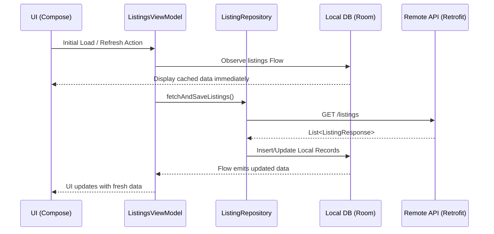

# Marketplace App

A modern, offline-first Android marketplace application built with Jetpack Compose, showcasing clean architecture and robust synchronization logic.

## 🚀 Features

- **Product Listings**: Browse a grid of available items with automatic data fetching.
- **Detailed View**: See full product details including high-quality images, descriptions, and pricing.
- **Favorites**: Mark items as favorites to access them quickly in a dedicated tab.
- **Create Listing**: Post new items with title, description, price, and image support (Gallery/Camera).
- **Offline Support**: 
  - Local persistence using Room DB.
  - Pending operations queue for changes made while offline.
  - Conflict resolution strategy (Last-Write-Wins with versioning).
- **Synchronization**: Automatic background syncing between local and remote data sources.

## 🛠 Tech Stack

- **UI**: Jetpack Compose
- **Dependency Injection**: Hilt
- **Persistence**: Room Database
- **Networking**: Retrofit & OkHttp
- **Image Loading**: Coil
- **Concurrency**: Kotlin Coroutines & Flow

## 🏛 Architecture

The project follows **Clean Architecture** principles, separating concerns into three distinct layers to ensure scalability, maintainability, and testability.

### 1. Presentation Layer (UI)
- **Jetpack Compose**: For building a modern, declarative UI.
- **ViewModels**: Manage UI state using `StateFlow` and handle user interactions by invoking Use Cases.
- **Hilt**: Handles Dependency Injection at the UI level.

### 2. Domain Layer (Business Logic)
- **Models**: Pure Kotlin data classes representing the core business entities (e.g., `Listing`).
- **Use Cases**: Encapsulate specific business rules (e.g., `GetListingsUseCase`, `ToggleFavoriteUseCase`).
- **Sync Logic**: Contains the `ConflictResolver` which implements the merging strategy for offline data.

### 3. Data Layer (Infrastructure)
- **Repositories**: Act as a single source of truth, coordinating between local and remote data sources.
- **Local (Room)**: Provides offline persistence and caching.
- **Remote (Retrofit)**: Handles API communication (mocked via `MockApiInterceptor` for this demo).
- **Mappers**: Convert between Data Entities, API DTOs, and Domain Models.

### 🔄 Data Flow
1. **User interaction** triggers a function in the **ViewModel**.
2. The **ViewModel** calls a **Use Case**.
3. The **Use Case** interacts with the **Repository**.
4. The **Repository** decides whether to fetch from the **Local Database** or the **Remote API**.
5. Data flows back up as a **Domain Model**, and the UI updates accordingly via **StateFlow**.

### 🎬 Sequence Diagram: Data Sync Flow

The following diagram illustrates how the app handles data synchronization, prioritizing local storage for a fast UI while updating from the network in the background.



## 🏗 Project Structure

```text
app/src/main/java/com/marketplace/app/
├── data/           # Data layer (Room, Retrofit, Repositories)
├── di/             # Hilt modules
├── domain/         # Business logic (Models, Use Cases, Sync)
├── presentation/   # UI layer (Screens, ViewModels, Theme)
└── utils/          # Helper classes
```

## ⚡ Performance & Resource Management

The application is optimized for low resource consumption and smooth performance on a wide range of Android devices.

### 🧠 Memory Management
- **Image Optimization**: Using **Coil** for asynchronous image loading. Coil automatically handles memory and disk caching, bitmap pooling, and downsampling to prevent `OutOfMemory` errors.
- **Lifecycle-Aware Collection**: UI components collect data from `StateFlow` in a lifecycle-aware manner, ensuring that background updates don't consume memory when the app is not visible.
- **Database Paging**: Room is used to persist data locally, reducing the heap memory footprint compared to keeping large lists in memory.

### ⚙️ CPU & Threading
- **Non-blocking I/O**: All database and network operations are offloaded to **Coroutines** using `Dispatchers.IO`, keeping the main thread free for UI rendering at 60/120fps.
- **Reactive Streams**: Use of **Kotlin Flow** ensures that the UI only recomposes when data actually changes, minimizing unnecessary CPU cycles.
- **Efficient Sync**: The synchronization logic runs incrementally. The `ConflictResolver` uses a lightweight Last-Write-Wins strategy with versioning to resolve data conflicts with minimal computational overhead.

## 🧪 Testing

The project includes unit tests for critical business logic, such as the `ConflictResolver`. To run tests:

```bash
./gradlew test
```

## 🚦 Getting Started

### Prerequisites
- **Android Studio Jellyfish** or newer
- **JDK 17**
- **Android SDK 34** (API Level 34)

### Running the App
1. **Clone the repository**:
   ```bash
   git clone https://github.com/boyscout0819/marketplace.git
   ```
2. **Open the project** in Android Studio.
3. **Sync Gradle**: Click on the "Elephant" icon or go to `File > Sync Project with Gradle Files`.
4. **Select a device**: Choose an emulator or a connected physical device.
5. **Run**: Press the green "Run" button or use the shortcut `Shift + F10`.

> **Note**: The app uses a `MockApiInterceptor` for demonstration purposes. This means it mimics network responses locally without requiring a real backend server. You can immediately see the app's functionality, including data fetching, synchronization, and error handling, right out of the box.

### Running Tests
To execute the unit tests for the domain and sync logic:
```bash
./gradlew test
```
The test results can be found in `app/build/reports/tests/testDebugUnitTest/index.html`.

## 📄 License

This project is licensed under the MIT License.
